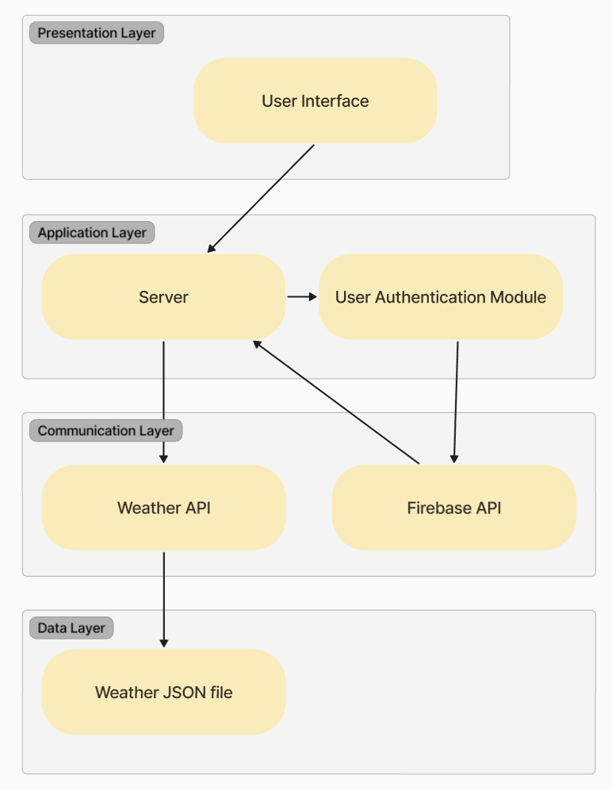
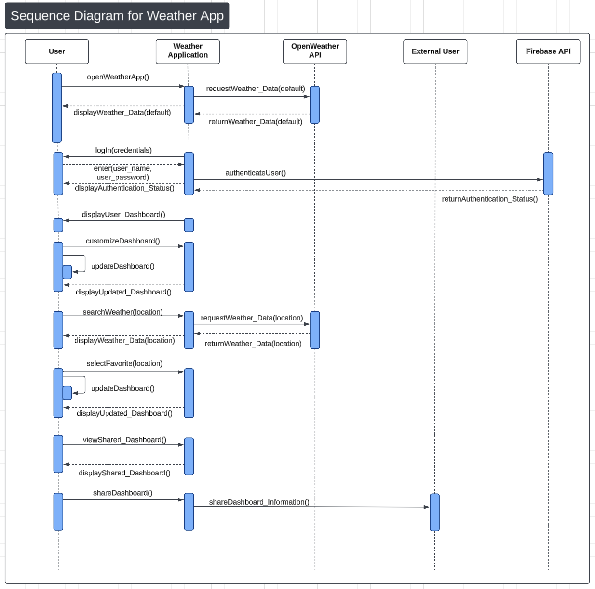
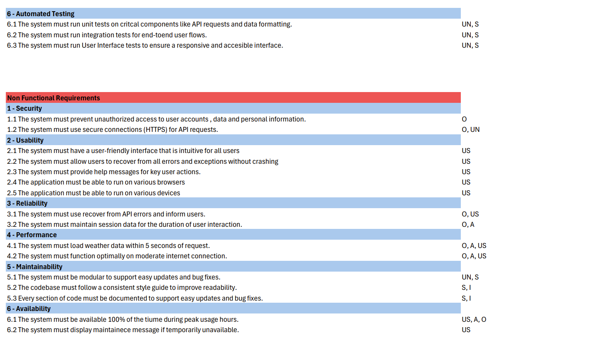

## Table of Contents

- [Architecture diagram](#architecture-diagram)
- [Sequence diagrams](#sequence-diagrams)
- [DFD](#dfd)
- [Activity plan](#activity-plan)
- [Test plan](#test-plan)

## Architecture diagram
Presentation Layer (Manages front end):

    UI: The main interface where the user interacts with. Sends and receives data from the server. 

Application Layer (Middle layer that manages client side requests, application logic, and data flow): 

    Server: Manages end to end requests and sends data appropriately.
    Authentication Module: Handles user authentication for login and log out.

Communication Layer (Handles external communication):

    Weather App API: The main source of weather data that sends data on a POST request.
    Firebase API: Authenticates users and handles login/logout. Stores user credentials.

Data Layer: Handles data storage 

    Database: Weather data is stored in a database upon saving or sharing the weather.

---
## Sequence Diagram:

## Test plan

