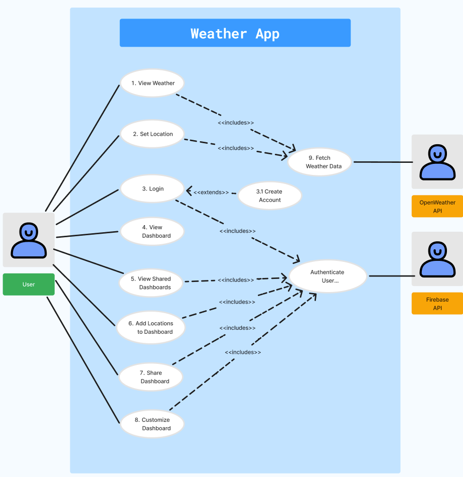

# Weather App Final Review 

This markdown file contains the final review of the jnst project.

#### Project Members
 - Jan Suratos
 - Tawana Ndlovu
 - Syed Saad Ali
 - Ashish Nayak

## Table of Contents

- [1 - General Requirements](#General-Requirements)
- [Requirements](#requirements)
- [Proto Personas](#proto-personas)
- [Use Cases](#use-cases)
- [Setup](#setup)
- [License](#license)

---

## 1 - General Requirements
  ### 1.1 - Project Overview
  We developed a **Weather Forecast Application** that provides real-time weather updates and a 5-day forecast for a user-selected location. Below is an overview of the features and their state:  

#### Features Overview
- **User Account Management**:  
  - Users can create accounts, log in, and access their personalized dashboards.  
  - **Status**: Fully implemented and functional.
- **Location Search**:  
  - Users can search for weather information by city name.  
  - **Status**: Fully implemented and functional.
- **Current Weather Display**:  
  - Displays temperature, weather conditions, and an icon representing the current weather.  
  - **Status**: Fully implemented and functional.
- **5-Day Weather Forecast**:  
  - Displays basic forecast information for the next five days.  
  - **Status**: Fully implemented and functional.
- **Dashboard Customization**:  
  - Users can personalize their dashboards by adding/removing widgets and saving favorite locations.  
  - **Status**: Fully implemented and functional.
- **Sharing Dashboards**:  
  - Users can share their dashboards with others.  
  - **Status**: Not implemented (saving functionality is incomplete).

### 1.2 Initial Requirements: Delivered vs. Missing
| **Requirement**                               | **Status**           |
|-----------------------------------------------|----------------------|
| User account creation and login               | Delivered           |
| Location-based weather search                 | Delivered           |
| Display of current weather with icon          | Delivered           |
| 5-day weather forecast display                | Delivered           |
| Dashboard sharing                       | Partially delivered |
| Dashboard customization                              | Delivered           |

- **Summary**: We delivered most of the requirements except for the dashboard sharing functionality, we did not get to start developing. Our initial requirements captured the necessary details to guide the project effectively.

### 1.3 - System Architecture and Key Components
#### Architecture Overview
The system follows a **Client-Server Architecture** with the following components:  
1. **Front-End**:  
   - **Technology**: Webpages (HTML files) JavaScript (main.js, register.js, dashboard.js, etc)  
   - Displays weather data and supports user interaction.  
2. **Back-End Server**:  
   - **Technology**: Python Flask (app.py)  
   - Handles API requests, user authentication, and database interactions.  
3. **Database**:  
   - **Technology**: MySQL  
   - Stores user data, dashboard configurations, and weather preferences.  
4. **External Weather API Integration**:  
   - **API**: OpenWeather API  
   - Provides real-time weather and forecast data.  

#### Design Patterns
- **Adapter Pattern**:  
  - Used to interface with the OpenWeather API for consistent data formatting.  
- **Singleton Pattern**:  
  - Ensures a single instance of the API client for optimal performance.  
- **Facade Pattern**:  
  - Simplifies the interface for fetching and displaying weather data to the front-end.  

### 1.4 Re-use Achieved
We implemented modular and reusable components, such as:  
- A centralized API client for weather data fetching.  
- Reusable UI components for weather widgets and forecasts.  
- [ PLEASE HELP HERE]

This approach facilitated clean code, reduced redundancy, and allowed for easier debugging.

### 1.5 - Remaining Backlog Tasks
- **Dashboard Sharing Functionality**: Finalize and integrate the feature. [TENTATIVE]
- **Dark Mode**: Personalize background to a dark theme.
- **Temperature Unit Conversion**: Implement functionality of converting between Celsius to fahrenheit

## Weather Forecast Application Summary
The application meets its primary goals, providing a robust and intuitive platform for users to access weather information and forecasts. While a minor feature remains incomplete, the core functionality is operational and demonstrates the potential for real-world use.

---

## 2 - CI/CD Report

### 2.1 Testing Strategies
#### Implemented Strategies
- **Test Plan**:  
  We developed a test plan addressing both functional and non-functional requirements.  
- **Testing Tools and Frameworks**:  
  - **Pytest**: Used extensively to test:  
    - **Functional Tests**: User requirements, weather data retrival, dashboard customization, CI/CD pipeline database testing.  
    - **Non Functional Tests**: Security, useability reliablity, performace, maintainability. 
    - **Component Testing**: Database, server, and UI were tested independently to isolate issues.
- **Automation**:  
  - All tests were manually initiated using Pytest. No automated CI tools (e.g., Jenkins or GitHub Actions) were employed to run tests automatically.  

#### Reflection and Future Improvements
- **Effectiveness**:  
  The current approach effectively identified and resolved bugs. However, manually triggering tests was time-consuming.  
- **Future Changes**:  
  - Introduce **automated testing tools** (e.g., GitHub Actions) to streamline testing and integrate it into the CI pipeline.  
  - Expand the test suite to include performance tests and load testing.

---

### 2.2 Branching Workflow
#### Workflow Implementation
- **Branch Organization**:  
  Separate branches were created for functional and non-functional tests, ensuring clarity and minimizing conflicts.  
- **Code Review Process**:  
  - A ruleset enforced mandatory reviews:  
    - At least **two team members** had to review and approve a test branch before merging it into the `development` branch.  
    - Direct merges to the `main` branch were blocked to maintain code quality.  
- **Success**:  
  This workflow was highly effective in ensuring code integrity and avoiding untested code in the main branch.

---

### 2.3 Deployment

- **Docker Implementation**:  
  The project is fully Dockerized, with a **Dockerfile** and services defined for deployment. Key configurations include:  
  - A MySQL database service with defined environment variables for database setup (e.g., user credentials and database initialization).  
  - Volume mapping for persistent storage and automatic database initialization using `weatherAppDB.sql`.  
- **Deployment Steps**:  
  1. Build and start the Docker containers using the provided Dockerfile and `docker-compose` configuration.  
  2. The application services will automatically connect to the MySQL container.  
  3. Use GitHub Pages for front-end deployment.  

#### Deployment Testing
The Dockerized environment was tested and is functional, ensuring smooth deployment on any compatible system.  

#### Future Enhancements
To enhance deployment reliability, consider integrating **Continuous Deployment tools** like Docker Hub or Kubernetes for scaling and automated updates.

## Requirements

**Functional:**
Users must be able to create, edit, and delete accounts.
Users will be able to log in to access their personal dashboard.
Users can personalize their dashboard (e.g., select favorite locations or adjust themes).
Logged-in users will be able to save favorite locations for quick access on the dashboard.
Logged-in users will be able to share their dashboard with other users.
The system will allow users to search for weather information by city name.
The system will display current weather for the selected location, including temperature, weather conditions (e.g., cloudy, rainy), and an icon representing the current weather condition.
The system will display a 5-day weather forecast, showing daily temperatures, weather conditions.
Users will be able to choose how to display temperature (Celsius/Fahrenheit) and weather formats (e.g., detailed/summary view).
Shared dashboards will be view-only for other users.
The system will notify the user of any errors in retrieving weather, account management, or sharing, if they occur.

**Non-Functional:**
The user interface should be simple and intuitive, allowing users to quickly access weather information.
The system will support multiple active users simultaneously. 
The system must not disclose any personal information about users apart from their name and shared dashboards to users of the system.
The app must work on common browsers like Chrome and Safari.
Basic login and logout functionality should be implemented to protect accounts.
The application must adapt to various screen sizes (web), so that it displays content properly depending on how large the browser screen size is.

---

## Proto Personas

  

    
  

  
  

    
  

  
  

    
  

  
  

    
  

## Use Cases

### Actors
**Actor**: Users (Primary) \
**Description**: Users are our primary actors in this application. They will be using the system most utilizing various use cases. Users will be able to view the weather, set locations, favorite locations to their dashboard, and share their dashboard with others. 

**Actor**: OpenWeatherAPI (Secondary)  \
**Description**: The OpenWeatherAPI receives requests from the application to provide weather data for viewing by users.

---

### Use Case 1. View Weather
**Primary Actor**: User  
**Description**: Users view the weather for a default location upon opening the app.  
**Pre-condition**: Successful API connection.  
**Post-condition**: Accurate weather data is displayed, including forecast and summary.

**Main Scenario**:
1. User opens the application.
2. Application requests data from the API.
3. API provides weather data.
4. Application displays the data.

**Extension**:
- 1a. Process completes within seconds.
- 2a. API connection fails.
    - 2a1. Application notifies the user of an error.

---

### Use Case 2. Set Location
**Primary Actor**: User  
**Description**: Users select a location to view weather data.  
**Pre-condition**: User has a location in mind.  
**Post-condition**: Application refreshes with accurate data for the selected location.

**Main Scenario**:
1. User inputs a location in the search bar.
2. System requests data for the location from OpenWeatherAPI.
3. API responds with weather data for the location.
4. System updates displayed information.

**Extension**:
- 1a. User misspells location.
    - 1a1. System notifies of invalid input.
- 1b. User selects location from dashboard if logged in.
- 2a. API request fails.
    - 2a1. System notifies of an error.

---

### Use Case 3. Login
**Primary Actor**: User  
**Description**: User logs into the application.  
**Pre-condition**: User has an account.  
**Post-condition**: User is logged in and sees saved dashboard.

**Main Scenario**:
1. System prompts login details.
2. User inputs username and password.
3. System validates credentials.
4. System logs user in and displays saved dashboard.

**Extension**:
- 2a. User does not have an account.
    - 2a1. System prompts to create an account.
- 2b. Invalid username or password.
    - 2b1. System notifies of error.

---

### Use Case 4. View Dashboard
**Primary Actor**: User  
**Description**: User views active dashboard.  
**Pre-condition**: User is logged in.  
**Post-condition**: Correct dashboard displayed.

**Main Scenario**:
1. System starts with a blank dashboard.
2. System verifies the user.
3. Dashboard is updated to display saved locations.

**Extension**:
- 2a. User not logged in.
    - 2a1. System prompts for login.
    - 2a2. Dashboard remains blank until login.
- 3a. No saved dashboard found.
    - 3a1. System displays default dashboard.

---

### Use Case 5. View Shared Dashboard
**Primary Actor**: User  
**Description**: User views a shared dashboard.  
**Pre-condition**: User is authenticated.  
**Post-condition**: Shared dashboard displayed in view-only mode.

**Main Scenario**:
1. User requests to view another user’s shared dashboard.
2. System authenticates the user.
3. System displays shared dashboard.

**Extension**:
- 2a. User not logged in.
    - 2a1. System prompts for login.

---

### Use Case 6. Add Locations to Dashboard
**Primary Actor**: User  
**Description**: User adds a selected location to their dashboard.  
**Pre-condition**: User is logged in with a selected location.  
**Post-condition**: Location added to dashboard and page updated.

**Main Scenario**:
1. User favorites the current location.
2. System authenticates the user.
3. System adds location to the dashboard.

**Extension**:
- 2a. User not logged in.
    - 2a1. System prompts for login.
- 3a. Location already favorited.
    - 3a1. System notifies location is already saved.

---

### Use Case 7. Share Dashboard
**Primary Actor**: User  
**Description**: User shares their dashboard.  
**Pre-condition**: User is logged in.  
**Post-condition**: Application generates a shareable link to the dashboard.

**Main Scenario**:
1. User requests to share dashboard.
2. System authenticates the user.
3. System generates and shares a link to the dashboard.

**Extension**:
- 2a. User not logged in.
    - 2a1. System prompts for login.

---

### Use Case 8. Customize Dashboard
**Primary Actor**: User  
**Description**: User customizes their dashboard layout.  
**Pre-condition**: User is logged in.  
**Post-condition**: Dashboard saved with custom layout.

**Main Scenario**:
1. User edits dashboard.
2. System authenticates user.
3. User rearranges locations as desired.
4. System saves changes.

**Extension**:
- 2a. User not logged in.
    - 2a1. System prompts for login.

---

### Use Case 9. Fetch Weather Data
**Primary Actor**: OpenWeather API  
**Description**: Requests weather data from API.  
**Pre-condition**: System has an authenticated API key.  
**Post-condition**: System receives weather data from API.

**Main Scenario**:
1. System requests data from API.
2. API responds with weather data.
3. System displays data to user.

**Extension**:
- 1a. API request fails.
    - 1a1. System notifies user of an error.

---

